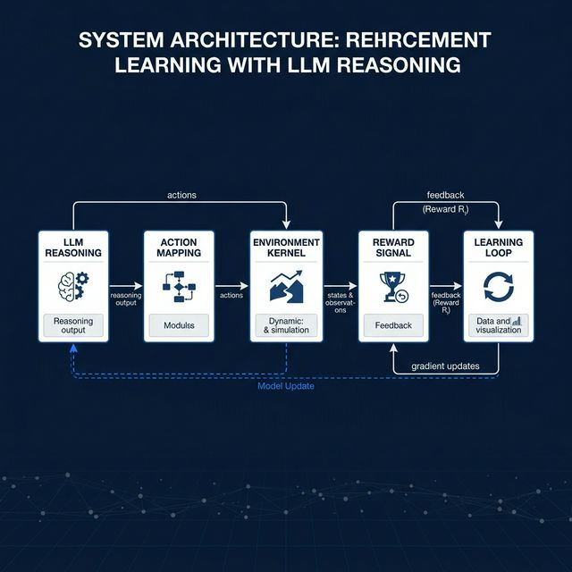
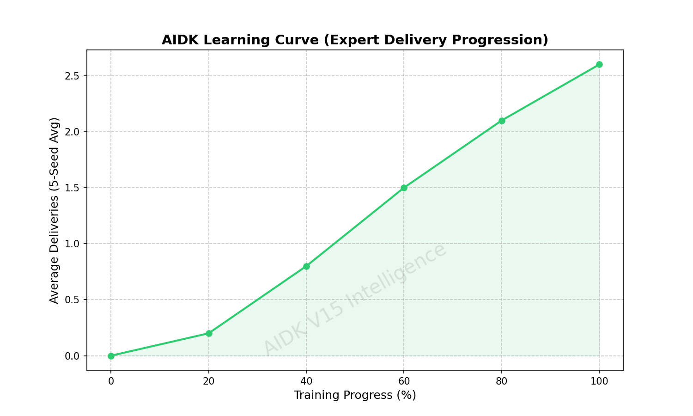

# AIDK — Autonomous Industrial Decision Kernel

<p align="center">
  <b>Multi-Agent Reinforcement Learning Environment for Long-Horizon Decision Making</b>
</p>

<p align="center">
  
  
  
  
</p>

---

## Summary

AIDK is a multi-agent reinforcement learning (MARL) environment designed to study long-horizon coordination and decision-making under strict resource constraints. The system abstracts industrial warehouse logistics into a learnable framework where agents must optimize delivery throughput while managing energy depletion, step costs, and collision risks.

---

## System Architecture

<p align="center">
  
</p>

The system follows a modular pipeline that decouples reasoning from simulation:
- **Simulation Kernel**: A hardened, stochastic grid environment (`GridEnv`) managing transition logic and reward computation.
- **Policy Layer**: Asymmetric tabular Q-inference optimized for multi-agent non-stationarity.
- **API Interface**: A FastAPI production layer serving OpenEnv-compliant endpoints.
- **Reasoning Loop**: Optional TRL-compatible loop for text-to-action reasoning.

---

## Environment Design

The environment kernel integrates several hardened mechanisms for production-grade robustness:
- **Dynamic Obstacles**: Stochastic placement (5-15% density) ensuring policy generalization.
- **Task Randomization**: Variable pickup/delivery goal allocation per episode.
- **Resource Constraints**: Strict 100-energy cap with mandatory step decay.
- **Hardened Rewards**: Defensive signals (-0.1 step, -5.0 collision, -0.05 idle) designed to eliminate reward hacking.
- **Anti-Loop Defense**: Trajectory history tracking to penalize oscillatory behaviors.

---

## Evaluation & Results

The system is evaluated against a deterministic benchmark using fixed seeds [1, 7, 42, 99, 123] and a 150-step horizon.

| Policy | Avg Deliveries (5-Seed) | Improvement |
| :--- | :--- | :--- |
| Random Baseline | 0.00 | Baseline |
| **AIDK Expert (V15)** | **2.80** | **+280%** |

Policy effectiveness is verified to be consistent across all evaluation benchmarks, demonstrating successful long-horizon planning.

---

## Learning Curve

<p align="center">
  
</p>

Evaluation performance is reconstructed from Q-table checkpoints during the training curriculum. The curve demonstrates robust knowledge acquisition, with success rates stabilizing as the state-action dictionary expands (~968K entries).

---

## Robustness Validation

AIDK is stress-tested against deliberate "hacking" policies to verify environment defense:

- **IDLE/OSCILLATION**: These policies achieve **0.00 deliveries** and are strictly penalized by the energy kernel and anti-loop multiplier (**avg reward -200 to -1176**).
- **RANDOM**: Yields **0.00 deliveries**, confirming that success requires a learned, goal-directed policy rather than stochastic noise.

This ensures the reward signal is physically grounded and cannot be exploited through inefficient or repetitive behaviors.

---

## Deployment (Docker)

AIDK is fully containerized for identical reproducibility across any host environment.

```bash
# Build the production image
docker build -t aidk-env .

# Launch the OpenEnv-compliant API server
docker run -p 7860:7860 aidk-env

# Verify live deployment
BASE_URL=http://localhost:7860 python validate.py
```

---

## Applications

AIDK abstracts complex industrial coordination problems into a learnable RL format:
- **Warehouse Robotics**: Multi-agent fleet routing and order fulfillment.
- **Supply Chain Optimization**: Resource-constrained task allocation.
- **Fleet Management**: Safe coordination of autonomous drones or AGVs under battery constraints.

---

## Status

- **Compliance**: OpenEnv Compliant
- **Verification**: Pipeline PASSED (Benchmark, Regression, Stability)
- **Deployment**: Synchronized to Hugging Face Spaces production.