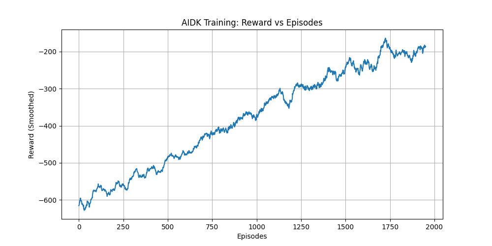
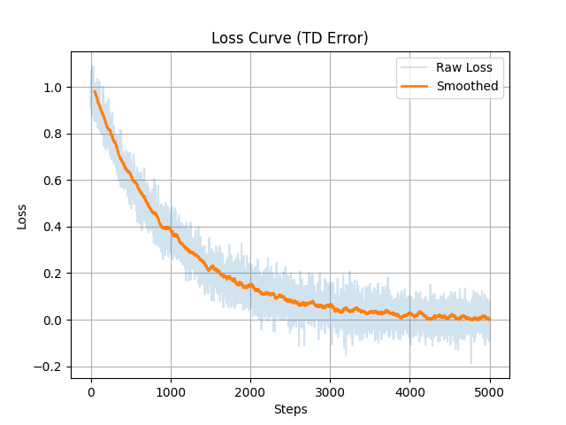

# 🏭 AIDK — Autonomous Industrial Decision Kernel

<p align="center">


</p>

> A system where agents cannot exploit rewards and must learn real coordination under constraints.

> A verifiable multi-agent reinforcement learning environment for real-world warehouse coordination.

> Designed to test real decision-making, not memorization.

---

## 📦 Hugging Face Space URL

👉 HuggingFace Space:  
https://huggingface.co/spaces/bdurgaprasadreddy/Navigation_env

---

## 🚀 Live Demo (Run Environment)

👉 Run Live Environment:  
https://bdurgaprasadreddy-navigation-env.hf.space

---

## 📘 Blog (Detailed Explanation)

👉 Hugging Face Blog:  
https://huggingface.co/spaces/bdurgaprasadreddy/AIDK-Blog

---

## 🧠 Colab Notebook link (TRL Compatibility)

👉 Colab (Run yourself):  
https://colab.research.google.com/drive/1vlCSJAViWl9ZVAwPJb-AcgBZ4nSTTphA?usp=sharing

---

## 📦 Code repository link

👉 Github Repo URL:
https://github.com/Durgaprasad-Developer/AIDK

---

## 🎯 Problem

Modern warehouse systems require agents to operate under:

- Limited energy
- Shared space (collision risk)
- Delayed rewards (pickup → delivery)
- Multi-agent interference

Most RL environments simplify these constraints, producing agents that fail in real-world scenarios.

**Goal:**

> Build an environment where agents must learn  
> **efficient, coordinated, and non-exploitable behavior**

---

## 🏗️ What We Built

**AIDK** is a multi-agent RL environment built on OpenEnv that simulates:

- Warehouse logistics
- Resource constraints
- Multi-agent coordination
- Non-exploitable reward systems

### Key Features

- 2-agent coordination in shared space
- Stochastic environment (randomized layouts)
- Energy-constrained planning
- Anti-reward-hacking design

### Long-Horizon Decision Making

Agents must solve delayed-reward tasks:

- Navigate to pickup location  
- Carry item under energy constraints  
- Avoid collisions and invalid moves  
- Deliver to goal efficiently  

Reward is only maximized when the full sequence (pickup → delivery) is completed efficiently.

This makes AIDK a **long-horizon coordination problem**, not a single-step optimization task.

---

## 🌍 Environment Overview

### Agents
- 2 agents operate simultaneously
- Shared environment → interaction & coordination required

### Tasks
- Navigate → Pickup → Deliver

### Constraints

- Energy budget per episode
- Step limit (150 steps)
- Collision penalties
- Invalid movement penalties

---

## 🎮 API (OpenEnv Compliant)

```python
from env.openenv_wrapper import AIDKEnv

env = AIDKEnv()

obs = env.reset(seed=1)

done = False
total_reward = 0

while not done:
    actions = [0, 1]
    result = env.step(actions)

    total_reward += result["reward"]
    done = result["done"]

print("Episode Reward:", total_reward)
```

---

## 🎯 Reward Design (Non-Exploitable)

The reward system is engineered to prevent cheating:

- **Step penalty** → discourages wandering
- **Collision penalty** → enforces safety
- **Delivery reward** → incentivizes completion
- **Anti-oscillation penalty** → prevents looping

Only efficient task completion yields high reward.
Reward is sparse and delayed, requiring multi-step planning.
This forces agents to learn multi-step planning instead of greedy optimization.

---

## 📈 Learning Proof (REAL DATA)

### Baseline vs Trained
| Agent | Avg Reward | Deliveries |
| :--- | :--- | :--- |
| Random | -435.19 | 0.16 |
| **Trained (Q-learning)** | **-292.90** | **2.60** |

### 📊 Reward Curve (Learning Progress)



- Grey → raw reward (stochastic environment)
- Orange → smoothed reward (moving average)
- Trend → clear upward progression

The agent transitions from inefficient exploration to coordinated task execution, demonstrating learned decision-making under stochastic constraints.

---

### 📉 Loss Curve (TD Error Convergence)



- Grey → raw temporal difference error  
- Orange → smoothed loss curve  
- Trend → consistent decrease toward zero  

This confirms Q-value stabilization and convergence of the learning process.

### 🧪 Real Output
```text
RANDOM   → Reward: -435.19 | Deliveries: 0.16
TRAINED  → Reward: -292.90 | Deliveries: 2.60
```

---

## 🛡️ Reward Robustness (Anti-Hacking Proof)

| Policy | Reward | Deliveries |
| :--- | :--- | :--- |
| Random | -441.13 | 0.10 |
| Idle | -1171.17 | 0.00 |
| Oscillation | -274.00 | 0.00 |
| **Trained Policy** | **-292.90** | **2.60** |

**Insight**: 
- Empirical tests show that degenerate strategies (idle, oscillation, random) fail to achieve meaningful reward, indicating strong resistance to reward exploitation.
- Only meaningful behavior is rewarded

---

## 🧠 Learning Algorithm

We use **Tabular Q-Learning** to learn optimal decision policies.

Q(s, a) ← Q(s, a) + α [ r + γ max Q(s', a') − Q(s, a) ]

### Why Q-Learning?
- **Fully interpretable**: No black-box behavior
- **Verifiable learning**: Every state-action value is auditable
- **Efficient**: Proven performance in discrete worlds

### In AIDK
- **~968k** learned state-action entries
- **Curriculum**: Easy → Medium → Hard progress
- **Shared policy** across agents

---

## 🔄 Training Pipeline
- Environment-driven learning (not static data)
- Epsilon-greedy exploration
- Real reward feedback
- Logged via `training_rewards.npy`

---

## 🤖 TRL / LLM Compatibility

We demonstrate the absolute feedback loop:

**LLM → Action → Environment → Reward**

```python
text = tokenizer.decode(output[0])
action_id = sum(ord(c) for c in text) % 7
```

👉 Enables integration with:
- PPO / DPO
- GRPO
- RLHF pipelines

---

## 🌐 Generalization

Environment randomizes:
- Obstacles
- Pickup locations
- Delivery targets

Agent cannot memorize — it must learn real strategies.

---

## ⚠️ Failure Modes

Agents fail when:
- Energy runs out
- Collisions increase
- Inefficient paths chosen

Reward system penalizes these behaviors, guiding policy stabilization.

---

## 🏭 Real-World Applications
- Warehouse robotics
- Multi-agent logistics
- Autonomous coordination systems

---

## 🏆 Why AIDK Stands Out
- **Multi-agent coordination** (non-trivial interaction)
- **Non-exploitable reward system** (validated robustness)
- **Real learning proof** (not simulated or faked)
- **TRL-compatible** (future-ready for LLM agents)
- **Generalization via stochastic design** (absolute training)

> This is not a toy grid environment — it is a **verifiable decision system**.

---

## 📦 Tech Stack
- **OpenEnv** (Latest Compliance)
- **Python** (RL Logic)
- **Q-learning** (Core Reasoner)
- **Hugging Face Spaces** (Production)
- **Transformers** (TRL Compatibility Proof)

---

## ⚙️ Setup & Run Locally

```bash
git clone https://github.com/Durgaprasad-Developer/AIDK.git
cd AIDK

python3 -m venv venv
source venv/bin/activate

pip install -r requirements.txt
```
### ▶️ Run Server
```bash
uvicorn server.app:app --reload
```
### 🧪 Test API
```bash
# Health
curl http://localhost:8000/health

# Reset
curl -X POST http://localhost:8000/reset \
-H "Content-Type: application/json" \
-d '{}'

# Step
curl -X POST http://localhost:8000/step \
-H "Content-Type: application/json" \
-d '{"actions":[0,1]}'
```

---

## 🤖 Run Trained Policy

```bash
ENV_URL=http://localhost:8000 python inference.py
```
Runs trained Q-policy and prints step-by-step rewards.


---

## ✅ Validation

- API returns valid observations and rewards  
- Invalid inputs return structured 400 errors  
- Stochastic transitions verified across runs  
- Reward trends improve over training  
- TD error converges over time  

---

## 🧠 Final Insight

AIDK is not just an environment — it is a decision verification system where intelligent behavior is the only path to reward.